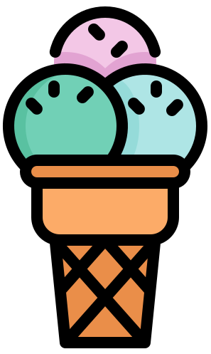
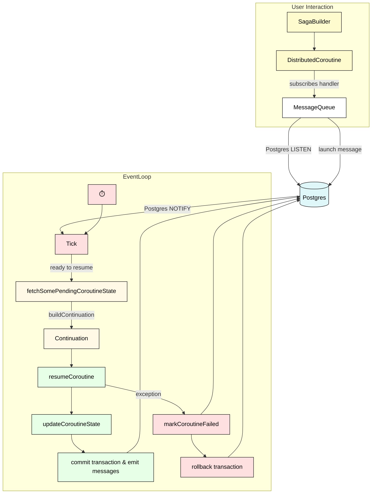

# Scoop



## TL;DR
This repository contains Scoop, a proof-of-concept implementation of **structured cooperation**. It is interesting for you if
you interact at all with distributed architectures (e.g., microservices). To understand what **structured cooperation** is, read
[the first article](https://developer.porn/posts/introducing-structured-cooperation/) linked below. If you want to explore the code,
read about [the important components](#important-components-and-high-level-flow) and use the diagram to navigate the codebase, although
I do recommend you [read the articles](#how-does-it-solve-the-problem) first.

## Table of Contents

- [Introduction](#introduction)
  - [What is this?](#what-is-this)
  - [What problem does it solve?](#what-problem-does-it-solve)
  - [How does it solve the problem?](#how-does-it-solve-the-problem)
  - [How do I run it?](#how-do-i-run-it)
  - [How do I grok it?](#how-do-i-grok-it)
  - [Where can I ask questions?](#where-can-i-ask-questions)
- [Overview](#overview)
  - [The state of Scoop](#the-state-of-scoop)
  - [Data model](#data-model)
  - [Important components and high-level flow](#important-components-and-high-level-flow)
- [Glossary of terms](#glossary-of-terms)

## Introduction

### What is this?
This repository contains Scoop, a proof-of-concept implementation of **structured cooperation** for distributed, message-based systems.
Structured cooperation is, essentially, an agreed-upon set of rules that services in a distributed system adhere to (one might therefore reasonably call it
a kind of *protocol*). These rules (it's really only one rule) are designed in such a way so that the resulting distributed system avoids many of the difficulties
traditionally associated with such systems—difficult to reason about, difficult to debug, difficult to manage errors and resources in, and only eventually consistent.

Scoop is an example implementation of these rules and could be categorized as an *orchestration library*---it helps you write business operations in distributed
systems. In that sense, it is similar to, e.g., [Temporal](https://temporal.io/). It is written in Kotlin and includes a custom messaging system built on Postgres.
However, the rules of structured cooperation are completely general and do not require either of those technologies. Indeed, the purpose of this repository
is primarily to serve as a stepping stone that will allow many additional implementations to be built, for different languages, frameworks, and infrastructure components.

### What problem does it solve?

Imagine you have a service that creates *accounts* and *contracts* (a contract is linked to an account) and emitting `ACCOUNT_CREATED` and `CONTRACT_CREATED`
messages. Other services listen to those messages and update their databases  accordingly, perhaps also performing additional actions such as sending welcome
e-mails, scheduling invoices, configuring access to support portals, and so on.

There is, quite obviously, a clear order in which these things must happen—in general, actions corresponding to `ACCOUNT_CREATED` need to be done before actions
corresponding to `CONTRACT_CREATED`. For example, foreign key constraints in a relational database require the account to already be there when persisting its
contract. Scheduling invoices for a contract require us to know the invoicing e-mail, which is part of the account payload. And welcome emails should probably
only be sent once *everything* is done—we don't want the customer to receive a welcome e-mail, only to find out they can't access something.

In a distributed system, this can be tricky to do because the order in which messages are emitted is not necessarily the order in which
they are picked up. Even worse, it's not the pickup-time we're interested in, but rather the time that all corresponding handlers *finish
executing*—only that guarantees we're actually ready to proceed.

Things get even more tricky when some part of the process results in an error. In normal code, we deal with these situations by "notifying the caller,"
e.g., by throwing an exception. In distributed systems, there's no concept of "distributed exceptions," in part because the code that emitted the
messages has already finished running. This makes error handling challenging and debugging even more so—for instance, exception stack-traces are limited
to just the service in which they are thrown (which is one reason why [tracing](https://en.wikipedia.org/wiki/Tracing_(software)) exists). The same goes for resource management—there's  no `try-with` that
spans services. When I say "resources," think less "opening a file" and more "temporarily spinning up a server farm."

All of the above can be, and is, solved in some fashion in existing distributed systems. However, the solutions are often ad-hoc, error-prone,
involve considerable complexity, and sometimes even require technologies of their own (such as [Jaeger](https://www.jaegertracing.io/)).

### How does it solve the problem?

Structured cooperation is a way to avoid these problems entirely. It does so by recognizing that the problems described above, along with many
others, are consequences of something the computer industry has already encountered, and solved, twice before. Once, around 1968, when [we started
thinking about the problems with GOTO](https://homepages.cwi.nl/~storm/teaching/reader/Dijkstra68.pdf), and then again more recently, around 2018, when
[the concept of structured concurrency started taking shape](https://vorpus.org/blog/notes-on-structured-concurrency-or-go-statement-considered-harmful/).

Structured cooperation takes its name from the latter and is the equivalent solution to the same problem in the context of distributed systems. As such,
it recovers the same properties recovered by implementing these solutions in the past and opens the doors to the same features, such as distributed exceptions,
stack traces, and resource handling.

The essence of structured cooperation is the following rule:

> A message handler can be broken down into consecutive steps. A subsequent step doesn't start executing until all handlers of all messages emitted in the previous
> step have finished.

And...that's pretty much it. But although it might not seem like much, the power you get by adhering to this simple rule is pretty amazing. The "consecutive steps" part is
usually called a [saga](https://microservices.io/patterns/data/saga.html), and is already a well-established pattern.

Before browsing this repository, you should read the articles that introduce structured cooperation:

1. [Deprecating Eventual Consistency—Applying Principles of Structured Concurrency to Distributed Systems](https://developer.porn/posts/introducing-structured-cooperation/)
2. [Towards an Implementation of Structured Cooperation](https://developer.porn/posts/implementing-structured-cooperation/)
3. [The Unreasonable Effectiveness of Structured Cooperation](https://developer.porn/posts/framing-structured-cooperation/) (optional)

### How do I run it?
Currently, the only way to interact with the code is via tests, but you're free to play around with things and expose the functionality however you want.

To run the tests, make sure you have Docker installed (Quarkus uses [Testcontainers](https://testcontainers.com/)), then clone the repo and either run 
`./gradlew clean test`, or run the tests from your IDE.

Note that some tests may be flakey, because almost all of them involve some sort of sleeping to let the handlers finish their work. If that happens,
increase the corresponding `Thread.sleep()` in the failing test.

### How do I grok it?
For the amount of punching power it packs, Scoop is actually relatively small and can probably be understood in an afternoon. Even though it uses
Quarkus and Kotlin, it does not use any terribly advanced features, and you should be able to make sense of the code without being versed in them. The only
real prerequisite is SQL, which is used quite heavily.

The following is just my recommendation and might or might not work for you. Stick to it if it does, ignore it if it doesn't—you do you. In any case,
don't be discouraged by fancy names like "coroutine" and "continuation"; the code is heavily documented, and I promise I don't assume you understand what
those mean (feel free to take a peek at the [glossary](#glossary-of-terms) below if you're interested).

Start by reading the first two articles above. Then, read about [the important components](#important-components-and-high-level-flow) below and gain a high-level
understanding of how Scoop is structured. 

Then, pretty much follow the diagram in that section. First, learn about how you interact with the library:
* How sagas are built and represented in the code ([SagaBuilder](src/main/kotlin/io/github/gabrielshanahan/scoop/blocking/coroutine/builder/SagaBuilder.kt), 
[DistributedCoroutine](src/main/kotlin/io/github/gabrielshanahan/scoop/blocking/coroutine/DistributedCoroutine.kt)). Don't worry about [EventLoopStrategy](src/main/kotlin/io/github/gabrielshanahan/scoop/shared/coroutine/eventloop/strategy/EventLoopStrategy.kt)
  at this stage.
* How they are subscribed to topics and how messages are emitted ([PostgresMessageQueue](src/main/kotlin/io/github/gabrielshanahan/scoop/blocking/messaging/PostgresMessageQueue.kt)). Don't worry about [HandlerRegistry](src/main/kotlin/io/github/gabrielshanahan/scoop/blocking/messaging/HandlerRegistry.kt)
  at this stage).

Next, follow the execution flow when a saga is picked up for handling (basically, what is depicted on the diagram below). Go as deep as you need to, but only as
far as you encounter any SQL—just trust it for now.
* Start in [EventLoop](src/main/kotlin/io/github/gabrielshanahan/scoop/blocking/coroutine/EventLoop.kt), and understand the two steps a `tick` is made of (i.e., starting continuations and resuming coroutines).
* Next, focus on how coroutines are resumed:
  * What state is fetched (not how—trust the SQL for now),
  * What a [Continuation](src/main/kotlin/io/github/gabrielshanahan/scoop/blocking/coroutine/continuation/Continuation.kt) is (leave `resumeWith` for the next step, 
    and also ignore the fact that it coincides with the [CooperationScope](src/main/kotlin/io/github/gabrielshanahan/scoop/blocking/coroutine/CooperationScope.kt), you'll come back to `CooperationScope` later), its
    [happy](src/main/kotlin/io/github/gabrielshanahan/scoop/blocking/coroutine/continuation/HappyPathContinuation.kt) and
    [rollback](src/main/kotlin/io/github/gabrielshanahan/scoop/blocking/coroutine/continuation/RollbackPathContinuation.kt) flavors, 
    and how it's built from the `CoroutineState`
  * How `resumeWith` works
* Finally, understand what happens based on the result of `resumeWith`

At this point, go back and take a separate look at [CooperationScope](src/main/kotlin/io/github/gabrielshanahan/scoop/blocking/coroutine/CooperationScope.kt), 
what capabilities it provides, and why it so happens that the `Continuation` instance can coincide with the `CooperationScope` instance.

Then, take a look at the SQL and `EventLoopStrategy`:
* The "start continuations" SQL in [MessageEventRepository](src/main/kotlin/io/github/gabrielshanahan/scoop/blocking/coroutine/structuredcooperation/MessageEventRepository.kt),
* The "pending coroutine run" SQL in [PendingCoroutineRunSql](src/main/kotlin/io/github/gabrielshanahan/scoop/blocking/coroutine/structuredcooperation/PendingCoroutineRunSql.kt), and how
  it's influenced by [EventLoopStrategy](src/main/kotlin/io/github/gabrielshanahan/scoop/shared/coroutine/eventloop/strategy/EventLoopStrategy.kt),
* How `EventLoopStrategy` is implemented ([StandardEventLoopStrategy](src/main/kotlin/io/github/gabrielshanahan/scoop/shared/coroutine/eventloop/strategy/StandardEventLoopStrategy.kt), ignore
  [SleepEventLoopStrategy](src/main/kotlin/io/github/gabrielshanahan/scoop/blocking/coroutine/builder/Sleep.kt) for now) and how [HandlerRegistry](src/main/kotlin/io/github/gabrielshanahan/scoop/blocking/messaging/HandlerRegistry.kt)
  provides a placeholder solution of the ["who is listening" problem](https://developer.porn/posts/implementing-structured-cooperation/#building-and-maintaining-a-handler-topology) in Scoop.

Finally, learn about individual functionalities:
* cancellation requests (search for `CANCELLATION_REQUESTED`. Don't confuse this with [cancellation tokens](src/main/kotlin/io/github/gabrielshanahan/scoop/shared/coroutine/context/CancellationToken.kt) bellow),
* [cooperation context](src/main/kotlin/io/github/gabrielshanahan/scoop/shared/coroutine/context/CooperationContext.kt),
* [sleeping and scheduled steps](src/main/kotlin/io/github/gabrielshanahan/scoop/blocking/coroutine/builder/Sleep.kt)
* [cancellation tokens](src/main/kotlin/io/github/gabrielshanahan/scoop/shared/coroutine/context/CancellationToken.kt) and [deadlines](),
* [try-finally](src/main/kotlin/io/github/gabrielshanahan/scoop/blocking/coroutine/builder/TryFinally.kt)

As always, AI is your friend here. However, I've gotten mixed results when I ask it questions about structured cooperation directly, so I think a better approach is to
ask questions such as "What files should I look at if I'm interested in understanding X."

### Where can I ask questions?
Feel free to [create an issue](https://github.com/gabrielshanahan/scoop/issues/new) if you're unclear on something, and I'll do my best to explain. The same goes for any 
topics you think should be discussed. Anything from "How would one do X using structured cooperation?" and "Wouldn't X be a better approach to solve Y?" to "I see problem X
in the way things are implemented" and "We should implement this in X next," and any other thoughts you might have, are welcomed. Ideally also search through issues to
see if something similar wasn't discussed elsewhere. 

## Overview

### The state of Scoop
Scoop is currently a proof-of-concept implementation. That means that its design is "best effort"—it's not guaranteed to be bug-free, the architecture isn't
stellar, shortcuts were taken, there's raw SQL all over the place, tests are something of a mess, indices probably aren't correct, and I'm sure it's lacking in many
other areas.

The purpose of Scoop in its current form is not to be a top-notch production-ready library, nor is it supposed to win beauty contests or serve as a demonstration
of correctly architectured code. **The purpose of Scoop is to convey an idea.** Therefore, I did my best to keep abstraction to a minimum and be as straightforward as
possible.

That being said, I also tried to build something that was *complete*. By that, I mean that I didn't knowingly skip any features that would be important for production usage.
I also took time to solve and document various obscure issues that arise when you try to use [Postgres for everything](https://postgresforeverything.com/) (which
I think you should, unless you have a good reason not to).

Message handlers (sagas) in Scoop are non-blocking and horizontally scalable out-of-the-box—that means you can spin up a single instance or 100, and everything should just
work. Using Postgres for everything also allows Scoop to make strict transactional guarantees—a given transactional step of a saga will either complete
in its entirety, including emitting messages, or it will not.

Above and beyond that, Scoop supports cancellations, rollbacks (via compensating actions), timeouts (via deadlines), scheduling, periodic scheduling, and sleeping,
along with distributed exceptions, stack traces, and resource handling via a `try-finally` mechanism. Due to the way it's designed, many of these things are actually
emergent, and not fundamental primitives. It also implements its own
[context propagation](https://projectreactor.io/docs/core/release/reference/advancedFeatures/context.html) mechanism, which is a way of sharing contextual data
between different steps of a handler, or even across parent-child handlers. It is the equivalent of reactive context in reactive pipelines or `CoroutineContext`in
Kotlin coroutines.

Scoop is implemented in two flavors, imperative and reactive. As you would expect, the latter is significantly more complicated, but including it should give
you everything you need to translate the principles of structured cooperation to pretty much any environment without needing to invest significant mental effort.

### Data model
From a data perspective, Scoop consists of two tables: `message` and `message_events`.

The former is used as an append-only message queue, and nothing particularly interesting or surprising goes on there. The latter is also append-only, and is fundamentally what allows Scoop to implement structured
cooperation. We use it to track interesting events that happen during a particular run of a handler—a message being emitted in a step, a rollback being initiated, a step finishing, etc.

Scoop then uses this data for three things:

1) To determine if a handler is ready to move on to the next step (i.e., if all handlers of all messages emitted in the previous step have finished)
2) To construct the coroutine state, which is used to build the continuation (both words and the process are explained below)
3) To pass around various metadata, such as the cooperation context and what specific exceptions happened

The events that Scoop records are:

| Message Event            | Explanation                                                                                                                                                                                                                                            |
|:-------------------------|:-------------------------------------------------------------------------------------------------------------------------------------------------------------------------------------------------------------------------------------------------------|
| `EMITTED`                | When a message is emitted.                                                                                                                                                                                                                             |
| `SEEN`                   | When a message is first seen by a particular handler (saga), in a sense, signifies the start of the saga. Also, anytime a handler starts doing anything, it locks this record to prevent other instances of the handler from running at the same time. |
| `SUSPENDED`              | After successfully finishing the execution of a step.                                                                                                                                                                                                  |
| `COMMITTED`              | After successfully finishing the execution of the last step (including the handlers of any messages launched from that step).                                                                                                                          |
| `ROLLING_BACK`           | After an exception is thrown in a step, or a `ROLLBACK_EMITTED` is first seen by a particular handler (saga). In this sense, it is sort of like the equivalent of `SEEN`, but for rollback. Locks are still only done on `SEEN` though.                |
| `ROLLBACK_EMITTED`       | When rolling back a step, a `ROLLBACK_EMITTED` is first written for each `EMITTED` written in that step, after which the rollback suspends until all child handlers have finished rolling back.                                                        |
| `ROLLED_BACK`            | After successfully finishing the execution of the compensating action of the first step (including the handlers of any messages launched from that step).                                                                                              |
| `ROLLBACK_FAILED`        | When an unhandled exception is thrown in a compensating action, or was thrown in a compensating action of a child and not handled in the parents `handleChildFailures`                                                                                 |
| `CANCELLATION_REQUESTED` | When a cancellation is requested by the user.                                                                                                                                                                                                          |

The column structure of `message_event` is (omitting those that are obvious):

| Column                 | Explanation                                                                                                                                                                                                                                                                                                                                                                                      |
|:-----------------------|:-------------------------------------------------------------------------------------------------------------------------------------------------------------------------------------------------------------------------------------------------------------------------------------------------------------------------------------------------------------------------------------------------|
| `message_id`           | The message that was being processed when the event was writen.                                                                                                                                                                                                                                                                                                                                  |
| `type`                 | One of the values from the table above.                                                                                                                                                                                                                                                                                                                                                          |
| `coroutine_name`       | The name of the handler/saga/coroutine.                                                                                                                                                                                                                                                                                                                                                          |
| `coroutine_identifier` | A unique identifier which is runtime generated. Serves to distinguish multiple instance of the same saga in situations where it is horizontally scaled.                                                                                                                                                                                                                                          |
| `step`                 | The name of the step that was being processed when the event was writen, or `null` when the event is writen by something external to the saga (e.g. a `ROLLING_BACK` in reaction to a `ROLLBACK_EMITTED`.                                                                                                                                                                                        |
| `cooperation_lineage`  | An array of UUIDs defining the cooperation scope of a particular run of a saga. All records with equal values in this column represent a single run of a saga. Any prefixes of that value are parent runs, i.e. runs of sagas that emitted messages which eventually lead to this saga being run. And conversely, child saga runs can be found as those that have the current value as a prefix. |
| `exception`            | Contains the serialized json of an exception, if relevant, or `null` otherwise.                                                                                                                                                                                                                                                                                                                  |
| `context`              | Contains the serialized `CooperationContext`, if it contains any value, or `null` otherwise.                                                                                                                                                                                                                                                                                                     |


For a slightly gentler introduction, read the blog posts linked above.

### Important components and high-level flow

As a hypothetical user, the main (and probably only) component you would interact with is `MessageQueue` and its implementation. Through this, you can launch a
message on the global scope (i.e., a toplevel emission) and subscribe handlers to topics. If you don't know what a *scope* is, read the blog posts linked above.

Handlers are implemented as instances of `DistributedCoroutine`, which consists of a list of `TransactionalSteps`.`SagaBuilder`provides a comfortable Kotlin
interface for building `DistributedCoroutine`instances, and can be seen used in practically every test.



The diagram above gives a handwavy description of how everything works together. There's no precise meaning of labels or boxes or particular shapes or colors—sometimes
they're function names, sometimes descriptions of something that happens, sometimes they describe data flowing, and sometimes something else. Think of it as something
you would jot down when listening to a lecture and interpret it intuitively.

When you subscribe a handler to a given topic, two things happen. One, Postgres
[LISTEN](https://www.postgresql.org/docs/current/sql-listen.html)/[NOTIFY](https://www.postgresql.org/docs/current/sql-notify.html) is used to subscribe to
new messages being published to the topic, two, a periodic process is started that repeatedly does two things:

1) checks if there are any `EMITTED` records haven't been seen yet, and writes a `SEEN` record for them. Something similar happens with `ROLLBACK_EMITTED` and `ROLLING_BACK`,
2) checks if any coroutine is ready to be run, which is called *resuming* a coroutine.

In the simplest case, a coroutine can be resumed if the structured cooperation rule mentioned above holds, i.e., all handlers of all messages emitted in the previous step
(if any) have finished. Things get a little more complicated when you add errors, cancellations, and timeouts to the mix, but essentially this is still what happens. All this
is done by [a moderately large piece of SQL](src/main/kotlin/io/github/gabrielshanahan/scoop/blocking/coroutine/structuredcooperation/PendingCoroutineRunSql.kt), into which the
outputs of [`EventLoopStrategy`](src/main/kotlin/io/github/gabrielshanahan/scoop/shared/coroutine/eventloop/strategy/EventLoopStrategy.kt) are spliced. The purpose of
`EventLoopStrategy` is explained in the articles above. 

When a coroutine is ready to be resumed, its state (e.g., what step was last executed, if it resulted in a failure or not, if any messages emitted in the last step
resulted in failures or not, if a rollback is in progress or not, etc.) is pulled from the database, and combined with the list of steps in the coroutine definition
to produce the object that actually executes the code of the next step. This object is called a `Continuation`.

Once we build a `Continuation`, we resume it (the terms "resuming a coroutine" and "resume a continuation" are used interchangeably here), which runs the code associated with the
appropriate next step. We then persist some additional state back to the database and commit/rollback the transaction (depending on if an exception was thrown in
the process of executing the step). This also commits (or doesn't) any messages emitted during the step execution, and, once all handlers of those messages finish
executing, the same process repeats until all steps have been executed.

The component responsible for doing this process (fetching the state of a coroutine, building continuations, running them, updating the state) is called an `EventLoop`,
and the name of this process is a `tick` - i.e., a `tick` is doing all that, for a single coroutine.

Here's a simplified version of the above, which is pretty much what you will find in the actual code (see 
[EventLoop](src/main/kotlin/io/github/gabrielshanahan/scoop/blocking/coroutine/EventLoop.kt))

```kotlin
class EventLoop {
    
    @Transactional
    fun tick(distributedCoroutine: DistributedCoroutine) {
        val state = fetchSomePendingCoroutineState()
        val continuation = distributedCoroutine.buildContinuation(state)
        try {
            val result = continuation.resume(state.lastStepResult)
            updateCoroutineState(distributedCoroutine, result)
        } catch (e: Exception) {
            // This happens in a separate transaction, otherwise it would also be rolled back
            markCoroutineFailedInSeparateTransaction(distributedCoroutine, e)
            // Rethrow exception to kill transaction
            throw e
        }
    }
}
```

### Glossary of terms
The explanations below involve some hand waving on my side and are far from precise. The point is to gain a semi-intuitive understanding so you can make sense of Scoop, not
to save you from studying CS. I encourage you to invest the time to understand all these terms more thoroughly. 

| Term           | Simplified explanation                                                                                                                                                                                                                                                                                                                                                                                                                                                                                                                                                                                                       |
|----------------|------------------------------------------------------------------------------------------------------------------------------------------------------------------------------------------------------------------------------------------------------------------------------------------------------------------------------------------------------------------------------------------------------------------------------------------------------------------------------------------------------------------------------------------------------------------------------------------------------------------------------|
| *saga*         | A generic technical term for "a long running transaction" or a sequence of multiple local transactions. A single business operation should typically be delimited by a database transaction. When an operation spans multiple services, and you don't have any way to do distributed transactions, you instead model it as a sequence of steps, each of which corresponds to a transaction - this is called a saga. A consequence is that you can't really do rollups in the classic sense, and need to instead define "compensating actions" for each step - code that's executed to "undo" whatever was done in that step. |
| *coroutine*    | A generic technical term for a function (= a sequence of steps) that can be paused or *suspended*. This is conceptually what happens in between the individual `TransactionalSteps`. The words *handler*, *saga* and *coroutine* are used interchangeably in Scoop.                                                                                                                                                                                                                                                                                                                                                          |
| *continuation* | A generic technical term for the following: given a sequence of steps (i.e., a function or a program), if you pick a starting step and an ending step, the "range of steps" in between the two is called a *continuation*. In otherwords, it's like a "slice" of a function or coroutine". From an ontological perspective, it's basically a lambda or anonymous function, i.e., something you can execute.                                                                                                                                                                                                                  |
| *event loop*   | A generic technical term for a component that keeps track of a queue of events (can be an actual queue of events, or just conceptually some conditions that become true at some point in time), and reacts to them. You will most often hear this term in connection with coroutines (because that's typically how they're implemented), reactive/non-blocking programming (because that's typically how it's implemented), or Node/JavaScript (because its execution environment is, fundamentally, an event loop).                                                                                                         |

—

<sub><sup><a href="https://www.flaticon.com/free-icons/gelato" title="gelato icons">Gelato icons created by Konkapp - Flaticon</a></sup></sub>
